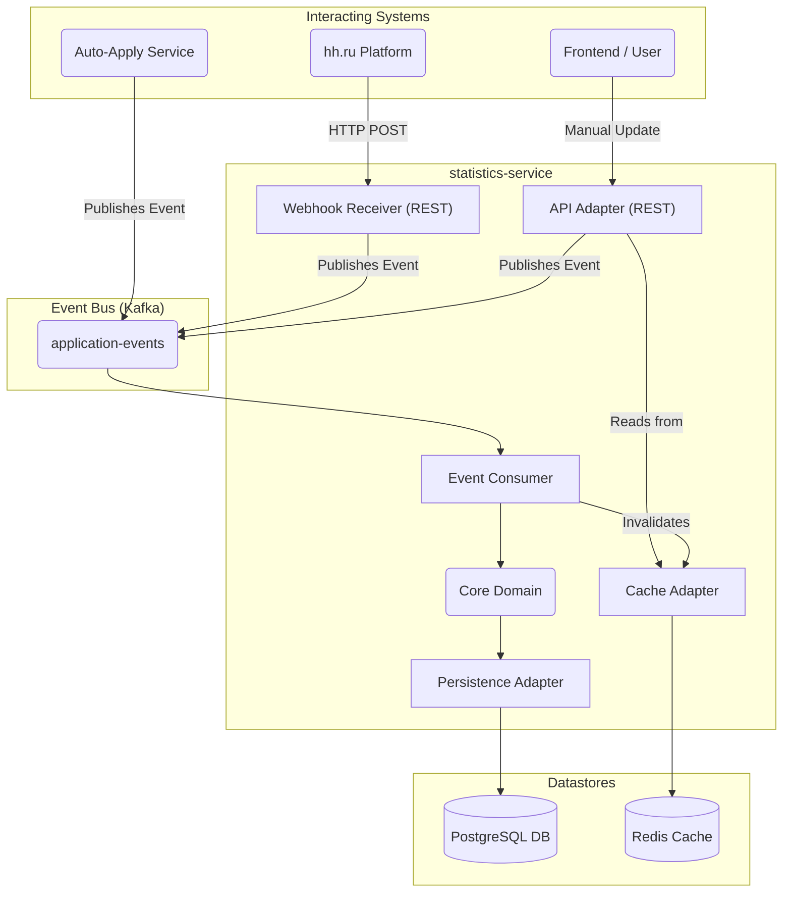

# Высокоуровневый дизайн: Сервис агрегации статистики

**Автор:** Иван Петровский
 
**Дата:** 16 ноября 2025 г.

---

### 1. Постановка задачи и цели

Цель — спроектировать и реализовать новый сервис «Менеджер статистики» для основного продукта. Этот сервис будет предоставлять пользователям агрегированную статистику и детальную историю их автоматических откликов на вакансии.

**Основные задачи:**
-   **Отображение агрегированной статистики:** Предоставить дашборд со сводкой по статусам откликов (например, Отправлено, Приглашение, Оффер).
-   **Отображение детальной истории:** Представить табличный вид всех откликов с их текущим статусом, компанией и ссылкой.
-   **Автоматизация обновлений статуса:** Автоматически получать и отражать изменения статусов с внешней платформы hh.ru.
-   **Возможность ручных изменений:** Позволить пользователям вручную обновлять определённые статусы откликов, которые невозможно отследить автоматически.
-   **Архитектура с заделом на рост:** Первая версия (MVP) должна быть реализована быстро, но архитектура должна быть модульной и расширяемой для поддержки будущих функций без необходимости полного переписывания.

### 2. Требования

#### 2.1. Функциональные требования (ФТ)

-   **ФТ1:** Система должна отображать сводную диаграмму с количеством по следующим статусам: `Отправлено откликов`, `Приглашения на интервью`, `Пройдено интервью`, `Получено офферов`, `Нет ответа`, `Отказ по резюме`, `Отказ после интервью`.
-   **ФТ2:** Система должна отображать таблицу всех индивидуальных откликов с колонками: `Компания`, `Ссылка на вакансию`, `Статус` и `Дата отклика`.
-   **ФТ3:** Система должна автоматически регистрировать новые отклики в момент их отправки через "Сервис автооткликов" платформы.
-   **ФТ4:** Система должна автоматически обновлять статусы существующих откликов (`Приглашения на интервью`, `Нет ответа`, `Отказ по резюме`), потребляя события из API hh.ru.
-   **ФТ5:** Система должна предоставлять REST API для ручного обновления статуса отклика на `Пройдено интервью`, `Получено офферов` или `Отказ после интервью`.
-   **ФТ6:** Система должна связывать статистику с существующей учётной записью пользователя на платформе.

#### 2.2. Нефункциональные требования (НФТ)

-   **НФТ1: Масштабируемость:** Система должна быть рассчитана на начальную нагрузку до 1000 активных пользователей с понятным планом масштабирования до 10 000+ пользователей.
-   **НФТ2: Задержка (Latency):** API-эндпоинты для получения статистики пользователя должны отвечать менее чем за 500 мс для 95-го перцентиля.
-   **НФТ3: Доступность:** Сервис должен быть высокодоступным. Процесс получения данных должен быть отказоустойчивым; ни одно обновление статуса с hh.ru не должно быть потеряно из-за временной недоступности сервиса.
-   **НФТ4: Актуальность данных:** Автоматически обновлённые статусы должны появляться на дашборде пользователя в течение нескольких минут после события на hh.ru.
-   **НФТ5: Согласованность данных:** Система будет работать по модели **конечной согласованности (Eventual Consistency)**. Допустимо, что статистика обновляется с небольшой задержкой после события.
-   **НФТ6: Расширяемость:** Дизайн должен быть модульным, чтобы облегчить добавление новых функций (например, новой статистики, интеграции с другими платформами) с минимальными изменениями.

#### 2.3. Допущения

Этот дизайн основан на следующих допущениях. Если какое-либо из них окажется неверным, дизайн может потребовать пересмотра.

-   **Существующий сервис пользователей:** Мы предполагаем, что в системе уже есть сервис пользователей или провайдер аутентификации, который отвечает за аутентификацию и предоставляет уникальный и стабильный `userId` для каждого пользователя.
-   **Ненадёжность вебхуков:** Мы исходим из того, что внешняя система вебхуков hh.ru **не предоставляет** гарантированной доставки или надёжного механизма повторных попыток. Следовательно, дизайн должен быть устойчив к пропущенным событиям от вебхуков.
-   **Начальная нагрузка:** Система рассчитана на начальную нагрузку около 1000 активных пользователей, но спроектирована так, чтобы её можно было масштабировать горизонтально до 10 000+ пользователей с минимальными изменениями.
-   **Приоритеты MVP:** Дизайн приоритизирует скорость разработки и простоту эксплуатации для MVP, отдавая предпочтение хорошо структурированному единому сервису, а не распределённой микросервисной архитектуре на данном этапе.
-   **Среда разработки и развёртывания:** Дизайн предполагает использование Docker-окружения как для локальной разработки (через Testcontainers), так и для продакшен-развёртывания (через Docker Compose или аналогичный оркестратор).

### 3. Высокоуровневая архитектура

Мы реализуем этот функционал как единый новый сервис (`statistics-service`), следуя паттерну **Модульный Монолит (Modular Monolith)**. Сервис будет построен с использованием **Hexagonal архитектуры (Ports & Adapters)**, чтобы обеспечить чёткое разделение ответственности и облегчить будущее выделение в микросервис, если это потребуется.

Архитектура сервиса — событийно-ориентированная. Вся логика изменения состояния унифицирована через единый Kafka-топик **`application-events`**. Этот топик агрегирует события из всех источников:

*   **События создания отклика** от внутреннего «Сервиса автооткликов».
*   **События обновления статуса** от вебхуков hh.ru.
*   **События ручного обновления** от пользователя через REST API.

**Redis** будет использоваться в качестве слоя кэширования для обеспечения высокой производительности основного эндпоинта, отдающего статистику.

#### 3.1. Диаграмма архитектуры

#### 3.2. Обзор компонентов

-   **Ядро домена (Core Domain):** Центральная часть приложения, содержащая всю бизнес-логику и доменные модели. Не зависит от фреймворков.
    -   **Сценарии использования (Use Cases):** `ApplicationUseCase` (обрабатывает всю логику создания/обновления), `QueryUserStatisticsUseCase` (обрабатывает логику запроса статистики).
    -   **Порты (интерфейсы):** `ApplicationRepositoryPort`, определяющий контракт для сохранения данных.

-   **Ведущие адаптеры (Driving Adapters - Input):**
    -   **API-адаптер (`@RestController`):** Предоставляет REST API для фронтенда (`GET /statistics`, `PATCH /applications/{id}`). При получении запроса на запись его единственная задача — опубликовать каноническое событие в Kafka-топик `application-events`.
    -   **Адаптер-приёмник вебхуков (`@RestController`):** Предоставляет REST-эндпоинт (`/webhooks/hh`) для приёма вебхуков от hh.ru. Его единственная задача — преобразовать тело запроса (payload) в наше каноническое событие и опубликовать его в Kafka-топик `application-events`.
    -   **Consumer событий (`@KafkaListener`):** **Единственный consumer** для топика `application-events`. Он обрабатывает ВСЕ события, связанные с откликами (создание, автоматические обновления, ручные обновления), и вызывает use case'ы ядра домена для выполнения необходимой "upsert"-логики.

-   **Ведомые адаптеры (Driven Adapters - Output):**
    -   **Адаптер персистентности (Spring Data JPA):** Реализует `ApplicationRepositoryPort`, взаимодействуя с базой данных PostgreSQL.
    -   **Адаптер кэша (Redis):** Используется API-адаптером для кэширования и Consumer'ом событий для инвалидации кэша после успешного сохранения данных.

### 4. Контракты API и событий

#### 4.1. Контракт REST API

-   `GET /api/v1/statistics`: Получение агрегированной сводки и детального списка откликов для аутентифицированного пользователя.
-   `PATCH /api/v1/applications/{applicationId}`: Позволяет пользователю вручную обновить статус одного из своих откликов.

#### 4.2. Контракт внутреннего события (схема Apache Avro)

-   **Название топика:** `application-events`
-   **Источник контракта:** Схемы Avro (`.avsc` файлы) будут храниться в выделенном Git-репозитории, который станет единым источником истины для всех сервисов-участников (продюсеров и консьюмеров).
-   **Схема:** Будет определена Avro-схема для представления канонического события. Она будет включать поля `eventId`, `userId`, `eventType` (`SUBMITTED`, `STATUS_CHANGED`), `payload` (содержащий специфичные для события данные) и `eventTimestamp`. Такой подход обеспечивает строгую типизацию, контроль версий и возможность безопасной эволюции контракта.

#### 4.3. Технологический стек

Сервис будет построен на базе установленного стека с использованием современных и надёжных open-source технологий.

-   **Язык/Фреймворк:** Java 17+ / Spring Boot 3.x
-   **Хранение данных:** PostgreSQL 15+ с использованием Spring Data JPA.
-   **Асинхронный обмен сообщениями:** Apache Kafka для надёжной и долговечной потоковой передачи событий.
-   **Кэширование:** Redis для высокопроизводительного кэширования API-ответов.
-   **Управление схемами:** Avro для определения схем событий в связке с Schema Registry (например, Confluent Schema Registry) для контроля и эволюции схем.
-   **Развёртывание:** Docker.
-   **Тестирование:** JUnit 5, Mockito и Testcontainers для высококачественного интеграционного тестирования с реальными экземплярами Kafka, PostgreSQL и Redis в контролируемой среде.

#### 4.4. Аутентификация и Авторизация

Безопасность и корректность доступа к данным являются ключевыми аспектами сервиса.

1.  **Аутентификация (Authentication):** Сервис `statistics-service` **не реализует** собственную логику аутентификации. Он является защищённым ресурсом в рамках существующей инфраструктуры платформы. Предполагается, что вышестоящий компонент (например, API Gateway) будет отвечать за проверку подлинности входящих запросов (например, валидацию JWT-токена). После успешной проверки `statistics-service` будет извлекать идентификатор пользователя (`userId`) напрямую из контекста безопасности (Security Context), предоставленного фреймворком.

2.  **Авторизация (Authorization):** Авторизация реализуется на уровне данных для предотвращения доступа одного пользователя к данным другого.
    -   **Для запросов на чтение (`GET /api/v1/statistics`):** Все запросы к базе данных будут строго фильтроваться по `userId`, полученному из контекста безопасности (`... WHERE user_id = ?`).
    -   **Для запросов на запись (`PATCH /api/v1/applications/{id}`):** Перед выполнением любого изменения система будет выполнять двухэтапную проверку:
        1.  Найти ресурс в базе данных по его уникальному `applicationId`.
        2.  **Убедиться, что поле `user_id` у найденного ресурса совпадает с `userId` из контекста безопасности.** Если они не совпадают, запрос будет отклонён с ошибкой `403 Forbidden`.

### 5. Схема базы данных

Persistence слой будет использовать базу данных PostgreSQL с двумя основными таблицами.

-   **`applications`:** Хранит текущее состояние каждого отклика. Оптимизирована для быстрых чтений.
    -   **Колонки:** `id (UUID)`, `user_id`, `hh_negotiation_id`, `company_name`, `vacancy_url`, `current_status`, `applied_at`, `version`, `created_at`, `updated_at`.
    -   **Индексы:** Уникальный индекс по `(user_id, hh_negotiation_id)` и неуникальный по `user_id`.

-   **`application_status_history`:** Append-only лог всех изменений статусов для аудита.
    -   **Колонки:** `id (BIGSERIAL)`, `application_id (FK)`, `status`, `source`, `timestamp`.
    -   **Индексы:** Неуникальный индекс по `(application_id, timestamp DESC)`.

### 6. Детальный разбор критических компонентов

#### 6.1. Сквозная обработка событий и надёжность
Чтобы гарантировать, что ни одно событие не будет потеряно, мы реализуем гарантию доставки **at-least-once**:
1.  **Надёжная передача:** Адаптеры будут публиковать сообщения в Kafka синхронно с `acks=all`. Успешный ответ клиенту будет отправлен только после того, как Kafka подтвердит, что сообщение надёжно сохранено.
2.  **Идемпотентный Consumer:** Consumer будет использовать комбинацию уникальных ограничений в БД (`uq_user_negotiation`) и оптимистичных блокировок (`version` колонка), чтобы безопасно обрабатывать дублирующиеся сообщения без повреждения данных.
3.  **Обработка ошибок:** Временные ошибки (например, БД недоступна) будут обрабатываться с помощью декларативной retry-политики. Постоянные ошибки (poison pills) будут автоматически перемещаться в **Dead Letter Queue (DLQ)**, чтобы не блокировать обработку основного топика.
4.  **Самовосстановление после пропущенных событий создания:** Система устойчива к сбоям в первоначальном потоке событий `application-events`. Если `Consumer событий обновления` получит обновление статуса для отклика, которого ещё нет в его базе данных, он не будет отбрасывать это событие. Вместо этого `ApplicationUseCase` выполнит операцию "upsert": он создаст запись об отклике, используя данные, доступные в теле (payload) события от вебхука, и применит обновление статуса в рамках той же транзакции. Это гарантирует, что пропущенное событие создания автоматически исправляется следующим же обновлением статуса для этого отклика.
5.  **Обработка откликов, созданных извне:** Логика "upsert" в `ApplicationUseCase` также корректно обрабатывает случаи, когда отклик был создан вне `сервиса автооткликов` нашей платформы (например, пользователь откликнулся вручную на сайте hh.ru). В этом сценарии внутреннее событие `application-events` не генерируется. Однако первое же событие от вебхука hh.ru для этого нового отклика инициирует создание записи в нашей базе данных, гарантируя, что все отклики пользователя будут учтены независимо от их происхождения.

#### 6.2. Эффективная агрегация статистики
Для обеспечения быстрого и отзывчивого дашборда:
1.  **Стратегия кэширования:** Будет использоваться паттерн **read-through caching**. Полностью сформированный JSON-ответ для `GET /statistics` будет кэшироваться в **Redis**.
2.  **Инвалидация кэша:** За инвалидацию кэша будет отвечать consumer событий. После успешного коммита транзакции в БД, которая обновила данные пользователя, `@TransactionalEventListener` инициирует команду `DEL` в Redis для ключа кэша этого пользователя.
3.  **Страховка:** Записи в кэше будут иметь **Time-To-Live (TTL)** 10-15 минут, чтобы обеспечить конечную согласованность даже в случае сбоя механизма инвалидации.

#### 6.3. Управление состоянием и гонки данных (Race Conditions)
Для обработки одновременных обновлений от автоматических вебхуков и ручных действий пользователя:
1.  **Логика на основе временных меток:** Система не будет полагаться на порядок обработки сообщений. Каждое событие обновления будет иметь авторитетную временную метку `eventTimestamp`.
2.  **Предотвращение устаревших обновлений:** Логика в ядре домена будет отклонять любое входящее событие, чья временная метка старше, чем у последнего уже записанного обновления для данного отклика. Это предотвратит перезапись свежих данных более старыми, но пришедшими с опозданием, событиями.

### 7. Межсервисное взаимодействие

Первичное создание записи об отклике в `statistics-service` инициируется событием `application-events`. Это событие поступает не из внешнего вебхука hh.ru, а публикуется напрямую внутренним **"Сервисом автооткликов"** в момент успешной отправки отклика.

Чтобы оба сервиса оставались слабосвязанными и могли развёртываться независимо, интеграция будет основана на общем **контракте событий**, а не на общей библиотеке кода.

1.  **Подход "Contract-First":** Выделенный Git-репозиторий будет служить источником истины для контрактов событий. Он будет содержать только файлы схем Apache Avro (`.avsc`).
2.  **Ответственность продюсера:** "Сервис автооткликов" будет отвечать за реализацию своего собственного Kafka-продюсера. Он будет использовать общую Avro-схему для генерации необходимых классов и публикации валидного события `application-events` в соответствующий Kafka-топик.
3.  **Ответственность консьюмера:** `statistics-service` будет потреблять сообщения из этого топика, используя ту же Avro-схему для десериализации события и создания первичной записи об отклике в своей базе данных.

Этот паттерн позволяет избежать зависимостей на этапе компиляции, даёт каждому сервису возможность управлять своим технологическим стеком и делает интеграцию устойчивой и простой в поддержке.

### 8. Обсуждение компромиссов и дальнейшее развитие

-   **КРИТИЧЕСКИ ВАЖНОЕ УЛУЧШЕНИЕ: Фоновая задача сверки данных (Reconciliation Job):** Из-за отсутствия гарантированного retry-механизма во внешнем API вебхуков hh.ru, фоновая задача сверки является **критически важным компонентом для долгосрочной целостности данных**. Эта задача будет периодически опрашивать API hh.ru, чтобы получать свежие статусы откликов пользователя и исправлять любые расхождения в нашей БД, вызванные пропущенными вебхуками. Хотя её реализация может быть отложена на период после MVP для ускорения запуска, она должна рассматриваться как задача с высоким приоритетом для обеспечения самовосстановления системы.

-   **Модульный монолит vs. Микросервисы:** Подход с модульным монолитом был выбран для MVP, чтобы приоритизировать скорость разработки и простоту эксплуатации, что соответствует целям стартапа на текущем этапе. Hexagonal архитектура гарантирует, что сервис можно будет легко выделить в отдельный микросервис в будущем по мере роста требований к масштабированию.

-   **Kafka vs. In-Memory Queue:** Выбор в пользу Kafka — это осознанное решение в пользу **целостности данных**. In-memory очередь привела бы к **безвозвратной потере всех ожидающих обновлений статуса** при перезапуске сервиса. Потерять событие «Приглашение на интервью» для пользователя — это критический провал, который ухудшает пользовательский опыт и подрывает доверие к продукту. Kafka обеспечивает необходимую надёжность, сохраняя события на диск, и даёт нам надёжные решения "из коробки" для обработки ошибок (retries, DLQ) и ясный путь для будущего масштабирования.

### 9. Оценка трудозатрат

-   **Фаза 1: Настройка проекта и ядро домена (12-20 часов):**
    -   Инициализация проекта, настройка зависимостей (JPA, Kafka, Redis, Testcontainers).
    -   Создание репозитория для Avro-схем и настройка build-плагина для кодогенерации.
    -   Реализация доменных моделей, сценариев использования и портов.
-   **Фаза 2: Реализация адаптеров и слоя персистентности (14-25 часов):**
    -   Реализация Kafka-консьюмера, REST-контроллеров, JPA-репозиториев.
-   **Фаза 3: Верификация и обеспечение стабильности (18-36 часов):**
    -   Настройка Testcontainers для всей инфраструктуры (PostgreSQL, Kafka, Redis).
    -   Написание комплексных интеграционных тестов, доказывающих корректную работу всего потока событий, включая обработку ошибок и race conditions.
-   **Фаза 4: Развёртывание и документация (6-12 часов):**
    -   Dockerfile, базовая настройка CI/CD, финализация API-документации.

**Общая оценка трудозатрат: 70-85 часов.**